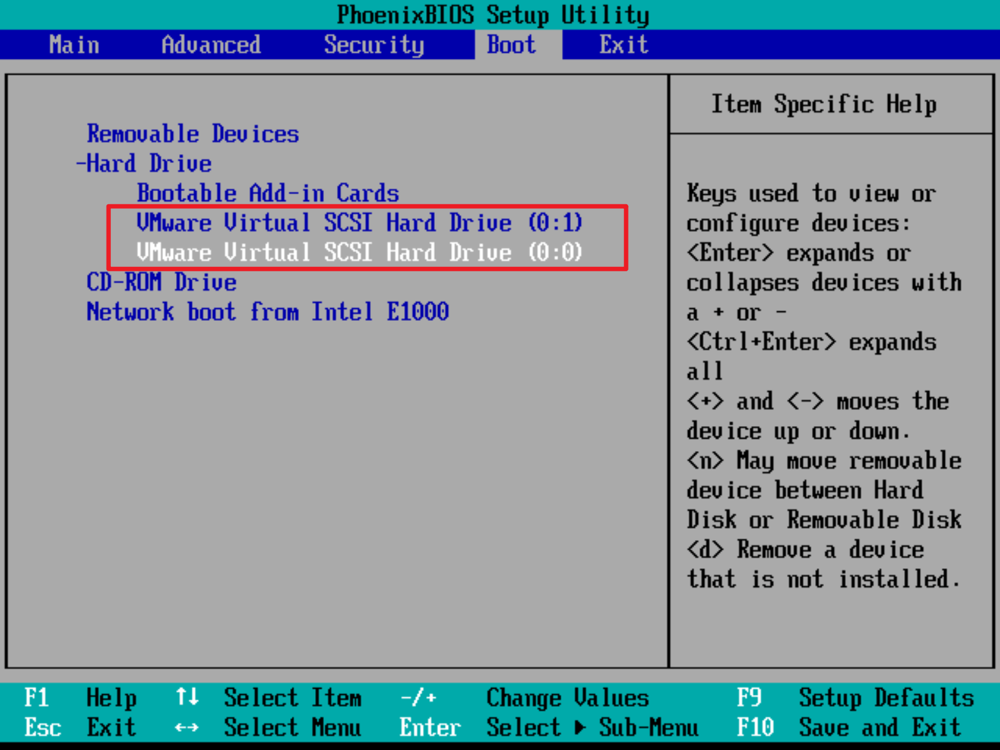
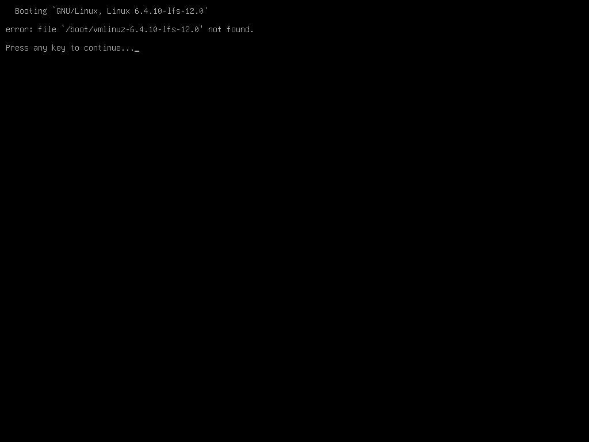
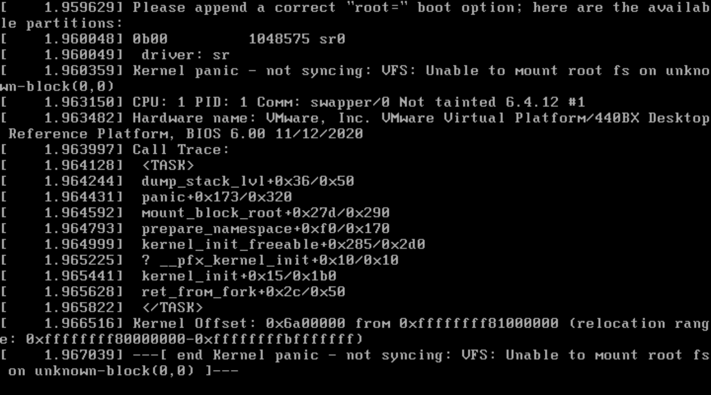
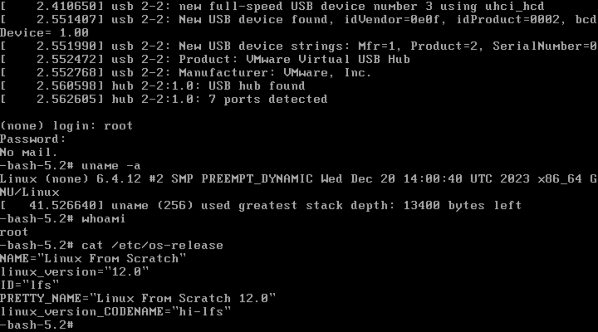

# Note on Linux From Scratch: Version 12.0

- [Note on Linux From Scratch: Version 12.0](#note-on-linux-from-scratch-version-120)
  - [Documents](#documents)
  - [Overview](#overview)
  - [Note](#note)
  - [Step-by-Step](#step-by-step)
    - [Preparations (chapter 2-4)](#preparations-chapter-2-4)
    - [Buildings (chapter 5-8)](#buildings-chapter-5-8)
    - [Final Step (chapter 9-11)](#final-step-chapter-9-11)
  - [Appendix](#appendix)
    - [Packages statistics](#packages-statistics)
    - [Disk partition result](#disk-partition-result)
    - [Decompression and cleanup](#decompression-and-cleanup)
    - [File: fstab](#file-fstab)
    - [File: grub.cfg](#file-grubcfg)
    - [Linux kernel extra config](#linux-kernel-extra-config)
    - [Snapshots](#snapshots)

## Documents

`sysvinit` documents:

- https://www.linuxfromscratch.org/lfs/view/stable/
- https://www.linuxfromscratch.org/lfs/view/12.0/
- https://lfs.xry111.site/zh_CN/12.0/index.html

`systemd` documents:

- https://www.linuxfromscratch.org/lfs/view/stable-systemd/
- https://www.linuxfromscratch.org/lfs/view/12.0-systemd/
- https://lfs.xry111.site/zh_CN/12.0-systemd/

More:

- https://www.linuxfromscratch.org/lfs/errata/12.0/
- https://www.linuxfromscratch.org/lfs/advisories/12.0.html
- http://www.tldp.org/HOWTO/Software-Building-HOWTO.html
- http://moi.vonos.net/linux/beginners-installing-from-source/

## Overview

Sketch of the book:

- Chapter 2-4: preparation, run by root
- Chapter 5-7: cross compiling, run by lfs
- Chapter 7-11: system installation, mainly run by chroot

Basic linux user and environment switch:

```shell
su - root
su - lfs
chroot /mnt/lfs ...
```

Disk partitions: `2.4. Creating a New Partition `

- Basic partitions

  - Root Partition: 20G; **MUST**.
  - Swap Partition: 2xRAM / 2G; **NOT NECESSARY**.
  - Grub Bios Partition: 1M；only with GPT.

- More partitions:
  - /boot: 200M.
  - /boot/efi: boot with UEFI.
  - /home:
  - /usr, /opt, /usr/src

## Note

I run it VMware Workstation 17 on Windows 11 (AMD CPU + 32G RAM).

LFS Building is on VM of Ubuntu 23.10 with 8G RAM + 16 core CPU + 30G disk,
and another new disk (here is 20G SCSI disk, displayed as _/dev/sdb_) for lfs system.

Make sure VM is _BIOS_ boot, not UEFI, or some extra modification are need to follow in Documents.

Scripts modifications:

- split `ch07.sh` into `ch07a.sh` (enter chroot) and `ch07b.sh`(build tools)
- add `begin_install/end_install` function in `ch05.sh`, `ch06.sh`, `ch07b.sh`, `ch08.sh`
- `locale` part in `ch09.sh`
- `/etc/fstab`, linux menuconfig, `/boot/grub/grub.cfg` in `ch10.sh`
- change `DISTRIB_CODENAME` in `ch11.sh`

## Step-by-Step

Note: some step order in chapter 2 and 3 are adjusted.

### Preparations (chapter 2-4)

```shell
# [normal user with sudo]
## Chapter 3. Packages and Patches
# download packages; ch03.sh not used

## sysvinit version
# https://www.linuxfromscratch.org/lfs/view/12.0/wget-list-sysv
# https://www.linuxfromscratch.org/lfs/view/12.0/md5sums
# wget --input-file=wget-list-sysv --continue --directory-prefix=$LFS/sources

## systemd version
# https://www.linuxfromscratch.org/lfs/view/12.0-systemd/wget-list-systemd
# https://www.linuxfromscratch.org/lfs/view/12.0-systemd/md5sums
# wget --input-file=wget-list-systemd --continue --directory-prefix=$LFS/sources

# use mirror site in China
# https://mirrors.nju.edu.cn/lfs/lfs-packages/
# https://mirrors.ustc.edu.cn/lfs/lfs-packages/
# https://mirrors.aliyun.com/lfs/lfs-packages/
wget https://mirrors.nju.edu.cn/lfs/lfs-packages/lfs-packages-12.0.tar
tar xf lfs-packages-12.0.tar -C lfs-packages

# check md5, make sure all packages are OK
pushd lfs-packages
  md5sum -c md5sums # | grep -i fail
popd
```

```shell
# [normal user with sudo]
## 2.2. Host System Requirements

# install Necessary packages in host system
sudo apt install gcc g++ make -y
sudo apt install bison gawk texinfo -y
# sudo dpkg-reconfigure dash
sudo ln -sf bash /bin/sh

# only use first half part in ch02.sh to create `version-check.sh`
# fix other problems if appears
bash version-check.sh
```

```shell
# [root]
su - root # or sudo -i

## 2.6. Setting The $LFS Variable
# here save $LFS to .bashrc/.bash_profile
# export LFS=/mnt/lfs
touch .bashrc
echo "export LFS=/mnt/lfs" >> .bashrc
source .bashrc
echo $LFS

## 2.4. Creating a New Partition
# Use cfdisk/fdisk/gdisk/parted to create new partitions.
# Use full new disk as root and the only partition.
fdisk -l # or lsblk, here is /dev/sdb
cfdisk /dev/sdb # choose dos not gpt
# fdisk /dev/sdb # input o - MBR(DOC), g - GPT for disklabel

## 2.5. Creating a File System on the Partition
# create ext4 file system
mkfs -v -t ext4 /dev/sdb1

## 2.7. Mounting the New Partition
# mount to $LFS
mount -v -t ext4 /dev/sdb1 $LFS --mkdir
```

```shell
# [root]
## Chapter 3. Packages and Patches
# create sources dir
mkdir -v $LFS/sources
chmod -v a+wt $LFS/sources

# copy packages (patches) and modified scripts
mkdir -p $LFS/sources/scripts/logs
chmod -R 777 $LFS/sources/scripts/logs

sudo cp path/sources/* $LFS/sources
sudo cp path/scripts/*.sh  $LFS/sources/scripts

chown -R root:root $LFS/sources/*
```

```shell
# [root]
## Chapter 4. Final Preparations
# !! step-by-step: copy, paste, run and check

# [ ! -e /etc/bash.bashrc ] || sudo mv -v /etc/bash.bashrc /etc/bash.bashrc.NOUSE
ch04.

# lfs directories show:
# /mnt/lfs
# ├── bin -> usr/bin
# ├── boot
# ├── etc
# ├── home
# ├── lib -> usr/lib
# ├── lib64
# ├── lost+found
# ├── sbin -> usr/sbin
# ├── sources
# ├── tools
# ├── usr
# └── var
```

### Buildings (chapter 5-8)

```shell
# [lfs]
## Chapter 5. Compiling a Cross-Toolchain
## Chapter 6. Cross Compiling Temporary Tools

export mysrcdir=$LFS/sources/scripts
export mylogdir=$mysrcdir/logs
export MAKEFLAGS='-j4' # -j<N> N change by you cpu

# run and log
sh $mysrcdir/ch05.sh | tee $mylogdir/ch05.log
sh $mysrcdir/ch06.sh | tee $mylogdir/ch06.log

# exit lfs user
exit
```

```shell
# [root]
## Chapter 7. Part I
# !! step-by-step: copy, paste, run and check
ch07a.sh

# [chroot]
## Chapter 7. Part II
export mysrcdir=/sources/scripts
export mylogdir=$mysrcdir/logs
export MAKEFLAGS='-j4'

sh $mysrcdir/ch07b.sh | tee $mylogdir/ch07.log

## 7.13. Cleaning up
rm -rf /usr/share/{info,man,doc}/*
find /usr/{lib,libexec} -name \*.la -delete
rm -rf /tools
```

```shell
# [chroot]
## Chapter 8. Installing Basic System Software
# this is most time-consuming part.
# make check/make test is ignored
# Check is wanted: Binutils, GCC,

export mysrcdir=/sources/scripts
export mylogdir=$mysrcdir/logs
export MAKEFLAGS='-j4'

sh $mysrcdir/ch08.sh | tee $mylogdir/ch08.log

# 8.35. Bash-5.2.15: change to use installed bash
exec /usr/bin/bash --login
# 8.26. Shadow-4.13: set root password
# echo "root:lfs#1991" | chpasswd # this use a predefined password in script
passwd root
```

### Final Step (chapter 9-11)

```shell
# [chroot]
## Chapter 9-11
# most hard part.

# /etc/fstab
# linux kernel: make menuconfig
# /boot/grub/grub.cfg
export mysrcdir=/sources/scripts

sh $mysrcdir/ch09.sh
# sh $mysrcdir/ch10.sh # run manually
sh $mysrcdir/ch11.sh
```

```shell
# THE END
logout
umount -Rv $LFS

# shutdown now # reboot
# first change disk order in bios when booting, system is loaded from first disk.
```

Movie disk in BIOS in VM (`-`/`+` keys)


## Appendix

### Packages statistics

```
# total packages：94 (not all used in sysvinit or systemd separately)
# *.xz - 48: tar -xf xx.tar.xz
# *.gz - 36: tar -xf xx.tar.gz
# *.bz2 - 2: tar -jxf xx.tar.bz2
# *.patch - 8: patch -Np1 -i xx.patch
```

### Disk partition result

```
# result
# fdisk -l /dev/sdb
# Disk /dev/sdb: 20 GiB, 21474836480 bytes, 41943040 sectors
# Disk model: VMware Virtual S
# Units: sectors of 1 * 512 = 512 bytes
# Sector size (logical/physical): 512 bytes / 512 bytes
# I/O size (minimum/optimal): 512 bytes / 512 bytes
# Disklabel type: dos
# Disk identifier: 0x4175b521
#
# Device     Boot Start      End  Sectors Size Id Type
# /dev/sdb1        2048 41943039 41940992  20G 83 Linux
#
# sudo lsblk /dev/sdb
# NAME   MAJ:MIN RM SIZE RO TYPE MOUNTPOINTS
# sdb      8:16   0  20G  0 disk
# └─sdb1   8:17   0  20G  0 part /mnt/lfs
```

### Decompression and cleanup

Modified from [luisgbm/lfs-scripts](https://github.com/luisgbm/lfs-scripts)

```shell
#!/bin/bash

package_name=""
package_ext=""
base_dir=$LFS/sources
base_dir=/sources
build_stage="lfs-xx"
startTime=""
endTime=""

###########################
begin_install() {
  startTime=`date +"%Y-%m-%d %H:%M:%S"`
  package_name=$1
  package_ext=$2
  cd ${base_dir}

  echo "[$build_stage] Starting build of $package_name at $startTime"

  tar xf $package_name.$package_ext
  cd $package_name
}

end_install() {
  endTime=`date +"%Y-%m-%d %H:%M:%S"`
  echo "[$build_stage] Finishing build of $package_name at $endTime"

  cd ${base_dir}
  rm -rf $package_name

  st=`date -d  "$startTime" +%s`
  et=`date -d  "$endTime" +%s`
  sumTime=$(($et-$st))
  echo "==>> Total time: $sumTime sec ($startTime => $endTime, $(date))."
}

cd ${base_dir}
###########################
```

### File: fstab

You can replace `/dev/sdXx` by UUID in `/etc/fstab`.

```shell
blkid
lsblk -o UUID,PARTUUID,PATH,MOUNTPOINT
```

### File: grub.cfg

Simple way to create `/boot/grub/grub.cfg` (Not recommend):

```shell
grub-mkconfig -o /boot/grub/grub.cfg
```

Some explain:

```shell
# /dev/sdb1 is only partition(also root)
# root=(hd0,1) 1 means root partition is  first part in /dev/sdbx
# /boot is in /dev/sdb1 and no separate /boot partition
# if you change disk order outer side BIOS, you may change to sda1
#

cat > /boot/grub/grub.cfg << "EOF"
# Begin /boot/grub/grub.cfg
set default=0
set timeout=5

insmod part_gpt
insmod ext2
set root=(hd0,1)
# search --set=root --fs-uuid <UUID of system> # use UUID/PARTUUID

menuentry "GNU/Linux, Linux 6.4.12-lfs-12.0" {
    linux   /boot/vmlinuz-6.4.12-lfs-12.0 root=/dev/sdb1 ro
    # linux   /vmlinuz-6.4.12-lfs-12.0 root=/dev/sdb1 ro # use separate /boot partition
    # linux   /boot/vmlinuz-6.4.12-lfs-12.0 root=PARTUUID=<partition UUID> ro # use UUID/PARTUUID
}
EOF
```

Bad case:

> error:file '/boot/vmlinuz-6.4.12-lfs-12.0' not found.



### Linux kernel extra config

**IMPORTANT** Some extra options are need in `make menuconfig` if you use VM with SCSI hard disk.

```
Device Drivers --->
   [*]Fusion MPT device support --->
      <*> Fusion MPT ScsiHost drivers for SPI
      <*> Fusion MPT ScsiHost drivers for SAS
      <*> Fusion MPT misc device (ioctl) driver
      [*] Fusion MPT logging facility
   SCSI device support --->
      [*] SCSI low-level drivers
        <*> LSI MPT Fusion SAS 3.0 & SAS 2.0 Device Driver
```

Bad case:

> ... [end Kernel panic - not syncing: UFS: Unable to Mount root fs
> on unknown-block(0,0) ]



### Snapshots



---

That's all. Good luck and have fun.
